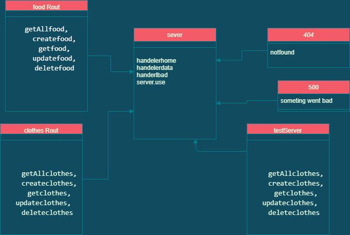

# basic-api-server

this server dealing with postgress database to add new record or delete or 
update or retrieve from db 

[PR]()

[herkouLink]()

[Action](https://github.com/emanmkhareez/basic-express-server/actions)

